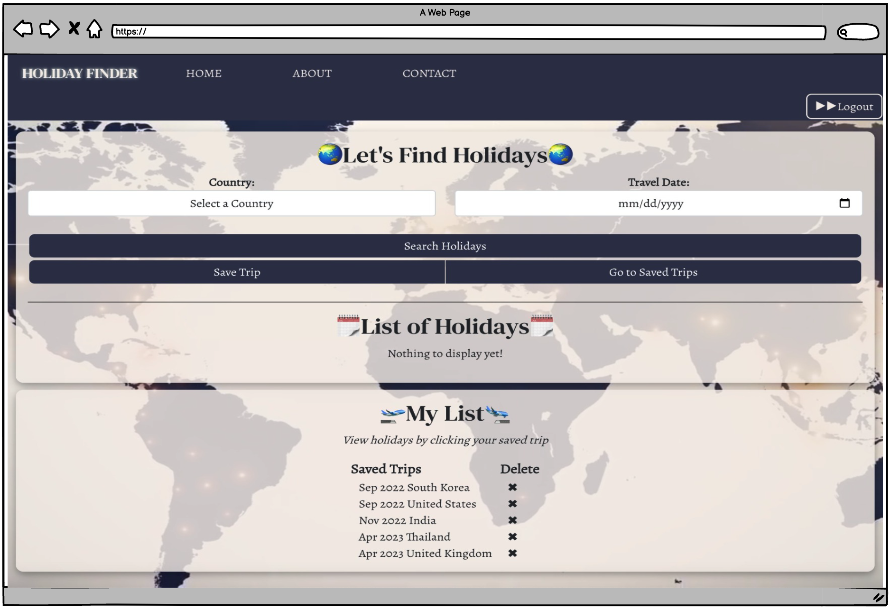

<p align="center">
  <h1 align="center">Holiday Finder</h1>

  <p align="center">
    <a href="https://techtonica-finalproject-lisa.herokuapp.com/">View Demo</a>
    |
    <a href="https://github.com/lisaleegithub/holiday-finder-app/issues">Report Bug</a>
    |
    <a href="https://github.com/lisaleegithub/holiday-finder-app/issues">Request Feature</a>
  </p>
</p>

## Contents

  - [About](#about)
  - [Features](#features)
  - [Built with](#built-with)
  - [Getting Started](#getting-started)

# About
<div align="center">  &nbsp;&nbsp;&nbsp;&nbsp;</div>
<br />
<br />
Holiday Finder is a web app that helps users to plan their holidays better by allowing them to discover if their travel dates align with their destination country’s holidays. You would be surprised how many different holidays there are around the world and some holidays are celebrated for days which means the place you are traveling to could be either extremely quiet and empty or festive and crowded.


## Features

- Search holidays by country and date
- Save and remove your searches
<br />
<div align="center">  &nbsp;&nbsp;&nbsp;&nbsp;</div>

## Built With
Holiday Finder was built using a PostgreSQL, Express, React, and Node (PERN) stack. 

It also uses:
* [Calendarific](https://calendarific.com/api-documentation)
* [Auth0](https://auth0.com/docs/get-started)


## Getting Started

### Prerequisites
**Docker**

This project relies on Docker for to run the PostgreSQL server for registered users. To use those features, you must install Docker first before continuing.

Windows:
- Follow Microsoft's instructions to install [WSL](https://docs.microsoft.com/en-us/windows/wsl/install-win10) and [Docker](https://docs.microsoft.com/en-us/windows/wsl/tutorials/wsl-containers#install-docker-desktop).

MacOS:
- Use [Homebrew](https://docs.brew.sh/Installation): `brew install --cask docker`
- [Follow the instructions on the Docker website](https://www.docker.com/)

Launch Docker Desktop once it is installed. 

**Node**

You'll need to install Node v14 or above. [`nvm`](https://github.com/nvm-sh/nvm) is highly recommended.

### Installation

1. Clone the repo:
   ```sh
   git clone https://github.com/lisaleegithub/holiday-finder-app
   ```
2. Install all NPM packages using this in the root directory:
   ```sh
   npm install
   ```
3. Database setup:
   1. Copy the root example environment file

   ```sh
   cp .env.example .env
   ```
   2. You can choose to edit `.env` or just use as-is.
   3. Run the following to setup the database with the seed file:
   ```sh
   npm run db:init
   ```

Start the app and view it at <http://localhost:3000> by using:
   ```sh
   npm start
   ```
Shut Down the Express and React development servers using `Ctrl-C` .


#### Set Up React client for `auth0`
If you want to try it with Auth0, the frontend needs to be setup with the following:

1. Copy the app's example environment file

   ```sh
   cp app/.env.example app/.env
   ```

2. The `.env` file allows the React app to use Auth0, and requires an Auth0 domain + client-id.
   - These can be obtained by signing up for an Auth0 account and [Registering a Single-Page Web Application](https://auth0.com/docs/get-started) in order to get these values.
   - This [graphic](https://images.ctfassets.net/23aumh6u8s0i/1DyyZTcfbJHw577T6K2KZk/a8cabcec991c9ed33910a23836e53b76/auth0-application-settings) from [Auth0's guide](https://auth0.com/blog/complete-guide-to-react-user-authentication/#Connect-React-with-Auth0) may be helpful to locating them. 
